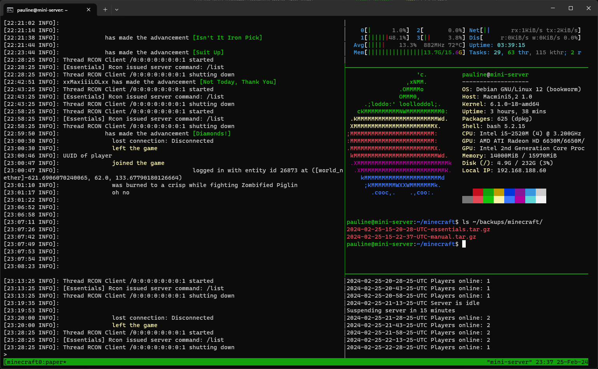
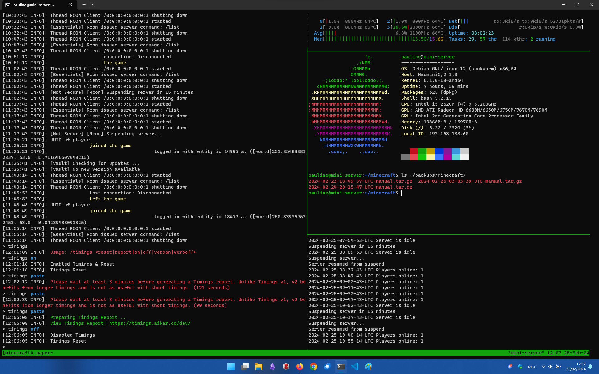

# Mac mini Linux Minecraft Server: An Extensive Setup-Guide

This document describes how to set up a minimal, extensible Minecraft server on a Mac mini or comparable device for a stable and easily maintainable system.



While it also serves the purpose to document some specific issues for the minecraft server that I set up for my friends, many steps will also apply to any other suited machine. I hope it will be helpful for you anyways and advise you to simply skip parts that you do not need. I included some helpful links to make it accessible to people who are new to Linux. The server can be managed from any operating system with an SSH client.

Feel free to open an issue to suggest improvements.

## Prerequisites

You'll need:

* A reliable internet connection and the ability to change your router settings
* A Mac mini, recent Raspberry Pi or similar machine with
  * A minimum of 8GB of RAM (my preference)
  * At least a dual core CPU

## Debian Installation

Installation options:

* 1GB EFI partition
* Btrfs main partition
* No swap partition
* Select SSH and essential packages only

My configuration:

```text
hostname: mini-server
user: pauline
```

It may be advisable to disable the startup sound for a server application, for the Mac mini this can be achieved by booting macOS in [single-user mode](https://support.apple.com/en-us/102603) and issuing ``nvram SystemAudioVolume=%00``. For other computers this can be usually configured in the UEFI menu.

Normally you should be able to immediately login to your Debian installation via SSH. However, because my 2011 Mac mini has a defective AMD GPU which prevents it from starting correctly, I needed to take a few extra steps described at the end of this document.

## Connection via SSH

Open a terminal and type the following:

```shell
ssh pauline@mini-server
```

You could also look up the IP adress of your Mac mini in your router settings and use it instead of the hostname.

## Basic Setup

Set up sudo:

```sh
su -
apt install sudo
adduser pauline sudo
exit
```

You may want to disable root login (see <https://wiki.archlinux.org/title/sudo#Disable_root_login>) and use ``sudo -i`` instead when neccessary, be careful not to lock yourself out when configuring it. You will have to logout and back in again in order for the changes to take effect.

Install an editor of your choice, preferably with syntax highlighting, a file manager and the terminal multiplexer ``tmux``:

```sh
sudo apt update && sudo apt upgrade
sudo apt install neovim micro
sudo apt install lf
sudo apt install tmux
```

## Minecraft Server

This section provides instructions for installing the [Paper](https://papermc.io/) Minecraft server. It offers good performance as well as wide compatibility with the existing Minecraft software ecosystem and a well made documentation.

### JDK

The Amazon Coretto 21 Java Development Kit (JDK) is recommended for running Paper, configuring it requires installing the following package first:

```sh
sudo apt install gnupg
```

Follow the instructions for installing the JDK using ``apt`` at <https://docs.aws.amazon.com/corretto/latest/corretto-21-ug/generic-linux-install.html>. Lastly, verify your installation with ``java -version``.

### Paper Server

```sh
mkdir ~/minecraft
cd ~/minecraft
```

Look up the Paper Minecraft server download link on <https://papermc.io/downloads/paper> and download it with ``curl`` (do not forget to change the file name according to your version for all subsequent steps):

```sh
sudo apt install curl
cd ~/minecraft
curl -OJ https://api.papermc.io/v2/projects/paper/versions/1.20.4/builds/430/downloads/paper-1.20.4-430.jar
```

Run the server with an initial and maximum heap size of 4GB, make sure to adjust the parameters according to the available memory reserves of your system:

```sh
java -Xmx4G -Xms4G -jar paper-1.20.4-430.jar --nogui
```

When first running the command a file `eula.txt` is created which needs to be modified to accept the end-user license agreement:

```sh
vi eula.txt
```

After editing the file accordingly you can rerun the command for starting the server or you may create directly a script for it and make it executable:

```sh
mkdir ~/scripts
nvim ~/scripts/run_minecraft_server
chmod +x ~/script/run_minecraft_server
```

Script to start the Paper Minecraft server ``~/scripts/run_minecraft_server`` (you can use this [Start Script Generator](https://docs.papermc.io/misc/tools/start-script-gen), make sure to retain a sufficient amount of memory):

```sh
#!/bin/sh

java -Xmx12800M -Xms12800M -XX:+AlwaysPreTouch -XX:+DisableExplicitGC -XX:+ParallelRefProcEnabled -XX:+PerfDisableSharedMem -XX:+UnlockExperimentalVMOptions -XX:+UseG1GC -XX:G1HeapRegionSize=8M -XX:G1HeapWastePercent=5 -XX:G1MaxNewSizePercent=40 -XX:G1MixedGCCountTarget=4 -XX:G1MixedGCLiveThresholdPercent=90 -XX:G1NewSizePercent=30 -XX:G1RSetUpdatingPauseTimePercent=5 -XX:G1ReservePercent=20 -XX:InitiatingHeapOccupancyPercent=15 -XX:MaxGCPauseMillis=200 -XX:MaxTenuringThreshold=1 -XX:SurvivorRatio=32 -Dusing.aikars.flags=https://mcflags.emc.gs -Daikars.new.flags=true -jar paper-1.20.4-430.jar --nogui
```

Now your server can be started by simply typing ``source ~/scripts/run_minecraft_server``.

### Server Configuration

The Minecraft [server properties](https://docs.papermc.io/paper/reference/server-properties) can be set with:

```sh
nvim ~/minecraft/server.properties
```

Set ``enforce-whitelist`` and ``white-list`` to ``true`` so that only whitelisted players can join your server. The server needs to be restarted in order for changes to take effect. I also increased the ``view-distance`` and ``simulation-distance`` and changed the welcome message that is displayed in the server list with ``motd=Welcome\! 🍏``, I also set this message to be displayed when I login into my SSH session in ``/etc/motd``.

### Plugins

PaperMC has detailed instructions for [adding plugins](https://docs.papermc.io/paper/adding-plugins) as well, but keep in mind that adding plugins increases the effort needed to maintain your server and might have a noticeable impact on performance.

One of the most popular plugins is [EssentialsX](https://hangar.papermc.io/EssentialsX/Essentials), I will use it primarily to periodically run a backup script. Simply look up the download link and save it to the correct directory:

```sh
cd ~/minecraft/plugins
wget https://github.com/EssentialsX/Essentials/releases/download/2.20.1/EssentialsX-2.20.1.jar
```

EssentialsX makes use of two addional plugins: Vault and LuckPerms. Install them in a similiar fashion. Restart your server and upon typing ``plugins`` into the server console your newly-installed plugins should show up.

## Administration

### Autostart

The Minecraft server can be configured to be automatically run in a detached terminal session on startup. The easiest way to manage this and allow that your server continues running even when you are logged out is via the terminal multiplexer ``tmux``. You can find a short, nicely written introduction here: <https://hamvocke.com/blog/a-quick-and-easy-guide-to-tmux> or refer to the official wiki of the [project](https://github.com/tmux/tmux/wiki/Getting-Started).

Here is th script to start the Paper Minecraft server in a new tmux session ``~/scripts/start_minecraft_session``, remember to make it executable:

```sh
#!/bin/sh

# Create a new tmux session and run the server in it
tmux new-session -d -s minecraft -n paper -c ~/minecraft '~/scripts/run_minecraft_server'
```

To automatically start the server every time the machine boots, first create a new systemd service unit:

```sh
sudo nvim /etc/systemd/system/minecraft.service
```

``minecraft.service``

```toml
[Unit]
Description=Minecraft Server
After=network.target

[Service]
User=pauline
Group=users
Type=forking
WorkingDirectory=/home/pauline/minecraft
ExecStart=/home/pauline/scripts/start_minecraft_session

[Install]
WantedBy=multi-user.target
```

And enable the service with the following command:

```sh
sudo systemctl enable minecraft
```

Reboot you system, reestablish the SSH connection and type ``systemctl status minecraft.service`` to see if the service started successfully. You can list active sessions with ``tmux ls`` and attach to your minecraft session by typing ``tmux attach -t minecraft`` or simply ``tmux a`` for the most recent session.
This enables running the server in the background even when closing the SSH connection, you can detach from the session again by pressing the prefix key ``ctrl + b`` followed by ``d``.

### Customization

It is well worth it to take a moment to configure ``tmux`` properply and activate additional features such as mouse support via its configuration file, which has to be created first.
A short introduction for customizing tmux can be found again at <https://hamvocke.com/blog/a-guide-to-customizing-your-tmux-conf/>.

```sh
mkdir -p ~/.config/tmux
nvim ~/.config/tmux/tmux.conf
```

The most important part is to install neofetch and update its configuration to flex on your friends:

```sh
sudo apt install neofetch
nvim .config/neofetch/config.conf
neofetch
```

For example you could change the displayed ASCII art and activate some additional properties:



### Minecraft Server Administration

Command issued in the server command line are not prefixed with a slash, e.g. just type ``help`` instead of ``/help``.

While ``whitelist.json`` can be edited directly, it is usually easier to manage it via the server command line running in the tmux session:

```text
whitelist add <player>
whitelist remove <player>
```

To give operator rights to a trustworthy player simply type ``op <player>``.

### Monitoring

For basic monitoring of your server it might be a good start to open a second panel next to your server console in tmux and run ``htop`` after installing it with:

```sh
sudo apt update && sudo apt upgrade
sudo apt install htop
```

[vnStat](https://github.com/vergoh/vnstat) is a network traffic monitor also available as binary package for Debian ([instructions](https://wiki.archlinux.org/title/VnStat) for Arch Linux also apply).

### Backups

Start by creating a simple script for manual backups:

```sh
nvim ~/scripts/backup_minecraft_server
chmod +x ~/scripts/backup_minecraft_server
```

It should only be run when the server is not running (otherwise temporarily disable auto saving with ``save-off`` and ``save-on``).

```sh
#!/bin/sh

# Create a backup of the entire ~/minecraft directory
# in ~/backups/minecraft
mkdir -p ~/backups/minecraft
current_date=$(date -u +"%Y-%m-%d-%H-%M-%S-UTC")
filename="$current_date-${1:-manual}.tar.gz"
echo "Backup filename: $filename"
echo "Creating archive..."
tar -zcf ~/backups/minecraft/$filename -C ~/minecraft .
```

For extracting an archive execute:

```sh
tar -zxf <backup.tar.gz>
```

The EssentialsX plugin can be used to automate your backups by searching for the appropriate option in ``~/minecraft/plugins/Essentials/config.yml`` and referencing your script:

```yaml
backup:
  interval: 300
  always-run: false
  command: '/home/pauline/scripts/backup_minecraft_server essentials'
```

### System Maintenance

Keep your system up to date and by regularly running the following commands while the server is down:

```sh
sudo apt update && sudo apt upgrade
```

Remember to copy your backups to a different drive in regular intervals. For updating Paper itself refer to their [manual](https://docs.papermc.io/paper/updating).

## Firewall and Port Forwarding

Install Firewalld (see <https://wiki.archlinux.org/title/Firewalld>):

```sh
sudo apt install firewalld
sudo systemctl enable firewalld.service
```

Administration is done with ``firewall-cmd``, use it to allow access to port ``25565``:

```sh
sudo firewall-cmd --add-port=25565/tcp --permanent
sudo firewall-cmd --reload
sudo firewall-cmd --list-all
```

Finally activate forwarding of port ``25565`` in your router settings. Additionally you might consider to configure a dynamic DNS in your router settings so that your friends don't need to update the servers IP address when it changes.

## Power Management

### Suspend

If your router supports waking up the server via LAN on incoming requests, then this could be a simple solution to automatically suspend and resume a small server.
While it certainly has it flaws, it does work well enough to suspend the server for most of the time when it's idle.

Therefore I wrote a script that utilizes the remote console for Minecraft servers (RCON) to interact with the Paper server and automatically suspend the computer. If no player is online at two discrete points in time in a row it will suspend the server unless a SSH connection is present.

As a first step you need to configure RCON in ``server.properties``:

```yaml
broadcast-rcon-to-ops=false
enable-rcon=true
rcon.password=<yourrconpassword>
rcon.port=25575
```

The command line tool to send commands to the server that we are going to use is [mcrcon](https://github.com/Tiiffi/mcrcon?tab=readme-ov-file). It is written in C and has very few dependencies, therefore building it from source is straightforward:

```sh
sudo apt install git
sudo apt install build-essential

mkdir -p ~/apps/mcrcon
git clone https://github.com/Tiiffi/mcrcon.git ~/apps/mcrcon
cd ~/apps/mcrcon

make
sudo make install
```

Take a look at the [``idle_suspend_minecraft``](/scripts/idle_suspend_minecraft) script and copy it to ``~/scripts/idle_suspend_minecraft``.
Next extend ``~/scripts/start_minecraft_session`` as followed to run it together with the server in your ``tmux`` session:

```sh
#!/bin/sh

# Create a new tmux session and run the server in it
tmux new-session -d -s minecraft -n paper -c ~/minecraft '~/scripts/run_minecraft_server'

# Run the script for automatically suspending the server in a new panel to the right
tmux split-window -h -t minecraft '~/scripts/idle_suspend_minecraft'

# Open a new panel above the suspend script
tmux split-window -v -b -t minecraft -c ~/minecraft
```

To enable the script to suspend the system, it is necessary to grant extra permissions for non-root users.
A detailed explanation for setting the permission can be found here: <https://askubuntu.com/a/992878>.

```bash
sudo apt install policykit-1
sudo nvim /etc/polkit-1/rules.d/85-suspend.rules
sudo chmod 755 /etc/polkit-1/rules.d
sudo chmod 644 /etc/polkit-1/rules.d/85-suspend.rules
```
``85-suspend.rules``
```js
polkit.addRule(function(action, subject) {
    if (action.id == "org.freedesktop.login1.suspend" &&
        subject.isInGroup("users")) {
        return polkit.Result.YES;
    }
});
```

### Wake up

Resuming a computer from suspend to RAM does not require any additional configuration. Any incoming request on the specified port will cause the router to wake up the server, for example a query for the status of your Minecraft server will be sufficient (which is also a drawback if players leave Minecraft running). But you can also trigger this for example with a PowerShell script, which is covered in this section.

Before being able to run a Powershell script in Windows, you need to explicitly allow the execution of scripts in Windows [PowerShell](https://learn.microsoft.com/en-us/powershell/module/microsoft.powershell.core/about/about_scripts) with:

```powershell
Set-ExecutionPolicy RemoteSigned
```

Players can now wake up the server by running the script ``Wake_up_Mini_Server.ps1``:

```powershell
Write-Output "Waking up Mini Server"
Test-NetConnection -ComputerName yourdynamicdns.net -Port 25565
Write-Host "Press any key to continue..."
$null = $Host.UI.RawUI.ReadKey("NoEcho,IncludeKeyDown")
```

## Mac mini (Mid 2011) AMD GPU Issue

My mid 2011 Mac mini (Macmini5,2) has a faulty dedicated AMD Radeon HD 6630M GPU (which seems to be a common issue) and while it also comes with integrated Intel graphics, this will prevent it from booting correctly. Unfortunately disabling the dedicated AMD graphics with the nvram ``gpu-power-prefs`` setting did not work.

For this reason you'll need to press ``e`` in GRUB menu and add ``nomodeset`` to the Linux kernel parameters on the first start. This will prevent the driver for the GPU to be loaded for the time being and allows you to permanently disable the AMD driver and fix the issue of a non-booting OS.
Issue ``sudo -i`` or ``su -`` before the running the following commands if ``sudo`` is not installed yet.

```sh
vi /etc/default/grub
```

Edit the following line so that it looks like this:

```text
GRUB_CMDLINE_LINUX="radeon.modeset=0"
```

Run ``update-grub`` to activate the changes and hopefully your Mac mini will boot successfully now.

## Notes

* When logging in via SSH in Windows command line, it might be helpful to disable the ``ctrl + v`` shortcut for pasting text in the command line settings because it prevents visual block selection in neovim.
* [CoreFreq](https://github.com/cyring/CoreFreq/), advanced CPU monitoring software
* [This article](https://wiki.archlinux.org/title/swap) covers how to configure swap space if desired
* Resource packs for Minecraft can be specified in ``server.properties``
